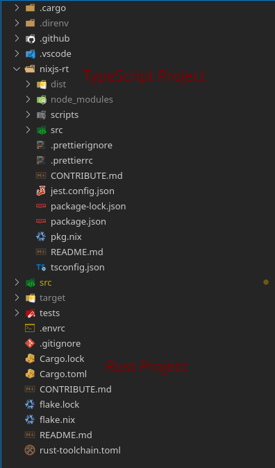
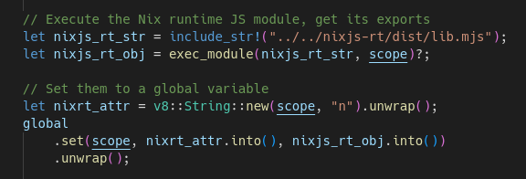
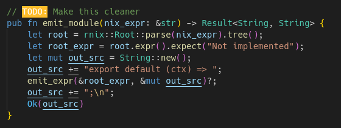
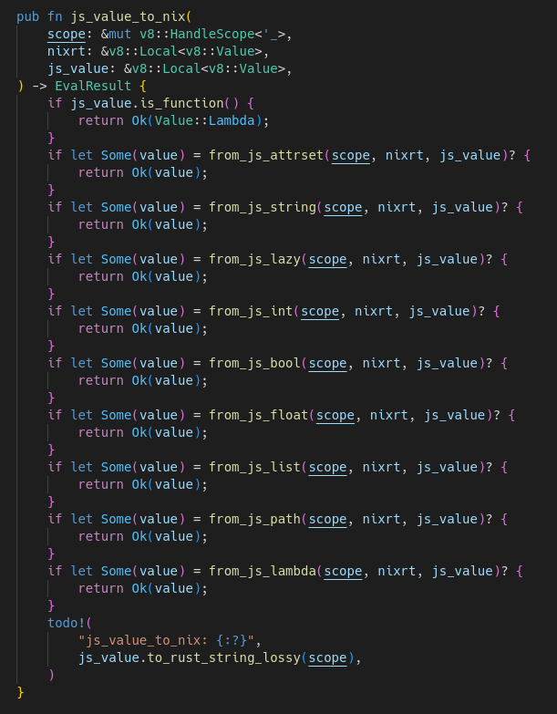
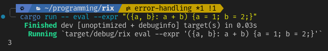
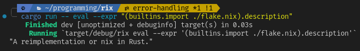

# Rust your own V8

Rust 🧡 JavaScript

---

# JS? In MY Rust??

- Yeah, why not
- Powerful and easy scripting
- Much easier than WASM
- Lua is stinky

---

# Examples where it's useful

- Game scripting/modding
- Advanced automations in professional programs
- Plugin system for large apps
- Basically anything that requires flexibility and isn't too performance-critical

---

# Tangent: why not Lua though?

- Arrays start at 1
- enough said

Oh and also:

- Syntax is less familiar compared to C-style languages
- No type-oriented tooling
- Less built-in features (e.g. no async)

---

# What prompted all of this anyway?

[rix](https://github.com/urbas/rix)

- Nix is a functional programming language for package/system configuration
- It's interpreted
- Someone decided it's a smart idea to transpile Nix to JS and run it that way
- Because it's written in Rust, it's called Rix
- I decided to help contribute

---

# How I found Rix

- I've been using NixOS for a bit now (i use nix btw)
- Stumbled on rix, looked exactly like my kind of project
- Started with a small PR adding a couple builtin functions
- Added more PRs over time, until I got added as a contributor

---

# Rix structure

Rix consists of 2 projects:
- The JS lib (compiled from TS)
- The Rust runtime, which uses V8
  - Imports JS using `include_str!`

---

# Loading the JS lib

- Include the JS file as a string
- Execute it within V8
- Set the result to a global variable

---

# Building the code

- Transpile the Nix code to JS code
- Yes, this is not clean

---

# Executing the code

Too much code to show, but

- Take the transpiled code, execute it in V8
- Any "imports" performed in nix are also transpiled and converted to JS values

---

# Parsing the results

- Given the results, convert them to Rust values
- Recursively iterate through all the JS classes, checking their instance type to know how to convert them

---

# Profit

---

# How can you do this at home?

I made a basic repo that you can use as a starter:

---

# Thanks!
